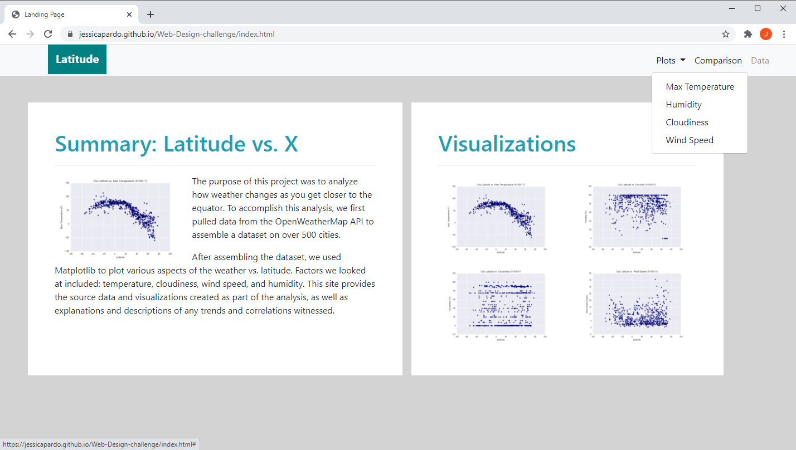

# Web-Design-challenge

# Web Visualization Dashboard (Latitude)

## Background

Data is more powerful when we share it with others! HTML and CSS are great tools to create a dashboard showing off the analysis done in a dataset.

## Latitude - Latitude Analysis Dashboard with Attitude

For this project, a visualization dashboard website using visualizations from a previously data analyzed [Weather repository: Python-API-challenge](https://github.com/jessicapardo/Python-API-challenge) was created. Specifically, [weather data](Resources/cities.csv) was plotted.

 Individual pages for each plot and a means by which it can be navigate between them. These pages will contain the visualizations and their corresponding explanations. Also have a landing page, a page where it can be see a comparison of all of the plots, and another page where it can be view the data used to build them.

The website consist of 7 pages total, including:

* A landing page containing:
  * An explanation of the project.
  * Links to each visualizations page.
* Four visualization pages, each with:
  * A descriptive title and heading tag.
  * The plot/visualization itself for the selected comparison.
  * A paragraph describing the plot and its significance.
* A Comparisons page that:
  * Contains all of the visualizations on the same page so we can easily visually compare them.
* A Data page that:
  * Displays a responsive table containing the data used in the visualizations.

The website has at the top of every page a navigation menu that:

* Has the name of the site on the left of the nav which allows users to return to the landing page from any page.
* Contains a dropdown on the right of the navbar named "Plots" which provides links to each individual visualization page.
* Provides two more links on the right: "Comparisons" which links to the comparisons page, and "Data" which links to the data page.
* Is responsive (using media queries).
 

 The live deployed website can be found here: https://jessicapardo.github.io/Web-Design-challenge/

### Copyright

Trilogy Education Services © 2019. All Rights Reserved.
